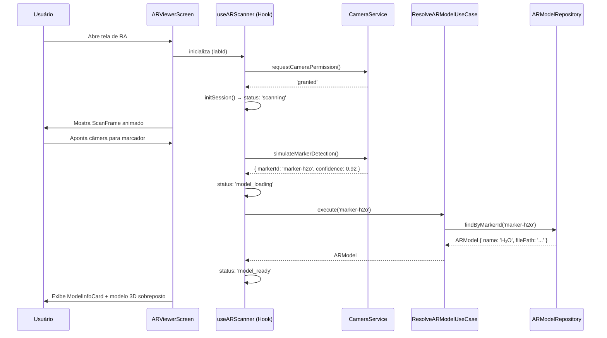

# AR-Lab Mobile (`ar-lab-react-native`)

<div align="center">

[](https://expo.dev)
[](https://reactnative.dev)
[](https://typescriptlang.org)
[](https://zustand-demo.pmnd.rs)
[]()
[](https://brasil.un.org/pt-br/sdgs/4)
[]()

<br/>

> **Aplicativo móvel em React Native com Realidade Aumentada** para apoio didático em laboratórios acadêmicos.
> Suporte a **Expo Go** para execução instantânea no dispositivo físico.
> Alinhado ao **ODS 4 da ONU — Educação de Qualidade**.

</div>

---

## 👥 Equipe e Funções

| # | Integrante | RA | Função |
|---|---|---|---|
| 1 | **Eduardo Augusto Prestes Júnior** | 252148 | *Tech Lead & Project Coordinator* — Arquitetura, Gestão e Dev Full-Stack |
| 2 | **Eduardo Cunha Soares** | 223988 | *Desenvolvedor Mobile & QA* — Testes e qualidade |
| 3 | **Leonardo de Arruda Macedo** | 223798 | *Desenvolvedor Mobile & Integração AR* |
| 4 | **Matheus de Souza** | 224282 | *UI/UX Designer & Frontend* |
| 5 | **Guilherme Augusto Ferreira** | 223291 | *Documentação & Pesquisa Científica* |

---

## 🎯 Visão Geral do Projeto

O **AR Lab Mobile** é um aplicativo educacional que transforma o smartphone do estudante em uma poderosa ferramenta de apoio dentro de laboratórios físicos. Ao apontar a câmera para **marcadores visuais** impressos nos roteiros de laboratório, o aluno visualiza **modelos 3D interativos** de moléculas, circuitos, estruturas biológicas e objetos geométricos diretamente sobrepostos ao ambiente real — sem necessidade de equipamentos especiais.

### 🌍 Alinhamento com ODS 4 — Educação de Qualidade
O projeto contribui diretamente para as metas da ONU ao:
- ✅ **Democratizar** o acesso a recursos visuais de alta qualidade em instituições com orçamento limitado
- ✅ **Ampliar** o entendimento de conceitos abstratos com visualização 3D imersiva
- ✅ **Incluir** estudantes com diferentes estilos de aprendizagem (visual, cinestésico)
- ✅ **Reduzir** a dependência de laboratórios físicos caros ou perigosos para etapas introdutórias

---

## 🛠️ Tecnologias Utilizadas — Justificativas Detalhadas

### 1. Expo SDK `54.x` — Plataforma de Desenvolvimento Mobile

**O que é:** Ecossistema e conjunto de ferramentas para criar, testar e publicar aplicações React Native universais (Android, iOS e Web).

**Por que foi escolhido:**
A adoção do Expo SDK 54 traz **agilidade máxima no desenvolvimento** e elimina a barreira de dependências nativas complexas (Android Studio / Xcode / Gradle). Através do aplicativo gratuito **Expo Go**, qualquer membro da equipe ou avaliador pode executar o projeto **diretamente em seu próprio celular físico** em segundos apenas escaneando um QR Code, sem necessidade de compilações nativas pesadas.

**Como funciona no projeto:**
- O servidor de desenvolvimento Metro é iniciado com `npx expo start`
- Gera um QR Code que conecta o app **Expo Go** (Android/iOS) diretamente à máquina de desenvolvimento
- Suporta modo `--tunnel` via ngrok para conectar o smartphone mesmo em redes Wi-Fi diferentes ou conexões de dados móveis
- Integra o `expo-camera` para captura de vídeo e permissões de hardware no Android e iOS

---

### 2. React Native `0.76.x` — Framework Mobile Principal

**O que é:** Framework de desenvolvimento mobile da Meta que permite escrever código JavaScript/TypeScript que compila para componentes nativos de iOS e Android.

**Por que foi escolhido:**
React Native foi escolhido pela sua capacidade de entregar **performance nativa** com uma única base de código. Diferente de soluções híbridas como Ionic (que usam WebView), o React Native renderiza componentes nativos reais — essencial para uma aplicação de câmera e RA onde a performance de frames por segundo é crítica. A versão 0.76 introduziu a nova **Hermes Engine** por padrão, reduzindo o tempo de inicialização em ~40%.

**Como funciona no projeto:** É o runtime que executa toda a lógica JavaScript e comunica com os módulos nativos do Expo e de plataforma.

---

### 3. TypeScript `5.6.x` — Linguagem de Tipagem Estática

**O que é:** Superset do JavaScript que adiciona tipagem estática opcional, interfaces, enums e outras funcionalidades de linguagens orientadas a objetos.

**Por que foi escolhido:**
Em um projeto com múltiplos desenvolvedores e camadas de Clean Architecture, o TypeScript é indispensável. Ele captura erros de tipo em tempo de compilação (antes do app rodar), documenta automaticamente contratos entre módulos e habilita o IntelliSense completo nos editores. No projeto, toda a camada de **Domain** usa TypeScript puro com interfaces como contratos — garantindo que qualquer implementação de repositório siga o contrato definido.

**Como funciona no projeto:** Todos os arquivos `.ts`/`.tsx` são transpilados pelo Metro Bundler via Babel antes de serem executados. Os caminhos de import são resolvidos via `baseUrl` e `paths` no `tsconfig.json`, permitindo imports como `@shared/components/Badge` ao invés de caminhos relativos complexos.

---

### 4. React Navigation `6.x` — Sistema de Roteamento

**O que é:** Biblioteca de navegação mais utilizada no ecossistema React Native, com suporte a Stack, Tab, Drawer e Modal navigators.

**Por que foi escolhido:**
O React Navigation foi escolhido por sua **maturidade**, tipagem TypeScript nativa (via `RootStackParamList`) e integração seamless com gestos nativos (`react-native-gesture-handler`). A tipagem das rotas garante que toda navegação seja **type-safe** — se uma tela requerer um parâmetro `labId`, o TypeScript garante que o código que navega para ela obrigatoriamente passe esse parâmetro.

**Como funciona no projeto:**
- `RootNavigator.tsx`: Define o Stack Navigator com 3 telas (`Home`, `LabDetail`, `ARViewer`)
- `types.ts`: Define `RootStackParamList` tipando os parâmetros de cada rota
- Transição `fade` é usada para o `ARViewer` para uma experiência mais imersiva
- O `NavigationContainer` recebe o tema dinâmico via `buildNavigationTheme()` para que a barra de navegação também mude com o dark/light mode

---

### 5. Zustand `5.x` — Gerenciamento de Estado Global

**O que é:** Biblioteca minimalista de gerenciamento de estado para React, baseada em hooks.

**Por que foi escolhido:**
Para o estado da sessão de Realidade Aumentada (`ARStatus`, modelo carregado, histórico de scans), precisávamos de um state manager que fosse **simples de escrever, performático e sem boilerplate excessivo**. O Zustand foi escolhido sobre Redux Toolkit porque:
1. Não requer Actions, Reducers e Dispatchers
2. Funciona diretamente com hooks (`useARScannerStore`)
3. Atualiza seletivamente apenas os componentes que consomem o estado alterado
4. É 5x menor que Redux em tamanho de bundle

**Como funciona no projeto:** O `arScannerStore.ts` define o estado completo da sessão AR — status (`initializing | scanning | model_ready | error`), modelo atual, histórico de varreduras. O `useARScanner` hook lê e escreve nesse store. Os componentes de UI consomem apenas as fatias de estado que precisam.

---

### 6. React Native Reanimated `3.x` — Animações de Alta Performance

**O que é:** Biblioteca de animações para React Native que executa animações na **thread nativa** (UI thread), ao invés da thread JavaScript.

**Por que foi escolhido:**
Animações executadas na JS thread sofrem de jank (travamentos) quando a thread está ocupada processando lógica de negócio ou requisições. O Reanimated move as animações para a thread nativa, garantindo **60fps constantes** mesmo durante operações intensas. É usado implicitamente pelo React Navigation para transições de telas.

**Como funciona no projeto:** O plugin `react-native-reanimated/plugin` no `babel.config.js` transforma automaticamente funções marcadas com `'worklet'` para executar na UI thread.

---

### 7. Expo Camera (`expo-camera`) — Captura e Permissões de Câmera

**O que é:** Biblioteca de câmera nativa oficial do Expo com suporte a captura em tempo real e controle de permissões.

**Por que foi escolhido:**
Substituiu a API nativa antiga por um fluxo universal compatível com **Expo Go**, Android e iOS sem requerer compilação Gradle manual.

**Como funciona no projeto:** O `CameraService.ts` abstrai toda a lógica de câmera em uma camada de serviço isolada, solicitando permissões via `Camera.requestCameraPermissionsAsync()` e simulando a detecção de marcadores AR em ambiente de desenvolvimento.

---

### 8. @react-native-async-storage/async-storage — Persistência Local

**O que é:** API de armazenamento assíncrono de chave-valor para React Native (equivalente ao `localStorage` do navegador, mas assíncrono).

**Por que foi escolhido:**
Necessário para **persistir a preferência de tema** do usuário entre sessões. Sem isso, o app sempre iniciaria no tema padrão (dark), ignorando a escolha anterior do usuário. O AsyncStorage é a solução oficial recomendada para dados simples que não requerem um banco de dados completo.

**Como funciona no projeto:** O `ThemeContext.tsx` salva a preferência em `@arlab:theme_mode` via `AsyncStorage.setItem()` sempre que o usuário alterna o tema. Na inicialização, lê esse valor com `AsyncStorage.getItem()` e aplica o tema salvo, evitando o "flash" de tema incorreto.

---

### 9. Sistema de Tema Dual (Dark/Light Mode) — Design Próprio

**O que é:** Sistema de tokens de design implementado do zero com suporte completo a dois temas.

**Arquitetura:**
```text
AppTheme (interface)
├── darkTheme (objeto)    → fundo #0A0E1A, acento ciano #22D3EE
└── lightTheme (objeto)   → fundo #F0F4FF, acento azul #0891B2
```

**Por que foi projetado assim:**
Ao invés de usar `Appearance.getColorScheme()` em cada componente (abordagem frágil e propensa a flickering), centralizamos toda a lógica no `ThemeProvider`. Cada componente recebe o tema via `useTheme()` e usa **apenas** as cores do objeto de tema — jamais cores hardcoded. Isso garante que qualquer mudança no tema redesenhe corretamente **100% da UI** sem exceções.

**Como funciona:**
1. `ThemeProvider` detecta a preferência salva (AsyncStorage) ou o sistema operacional
2. Expõe `theme`, `isDark`, `toggleTheme` e `themeProgress` (Animated.Value 0→1)
3. `ThemeToggle` anima a transição visualmente com `Animated.timing` interpolando cores
4. `buildNavigationTheme()` converte o `AppTheme` para o formato do React Navigation

---

### 10. Sistema de Responsividade — Design Próprio (`responsive.ts`)

**O que é:** Utilitários de escala baseados na resolução de referência iPhone 14 (375×812).

**Funções disponíveis:**

| Função | Uso | Exemplo |
|---|---|---|
| `rw(n)` | Escala horizontal (larguras, padding H) | `rw(16)` → ~17px em iPhone 15 Pro |
| `rh(n)` | Escala vertical (alturas, padding V) | `rh(24)` → ~28px em iPhone 15 Pro |
| `rs(n)` | Escala moderada (fontes, ícones) | `rs(15)` → valor balanceado |
| `rf(n)` | Escala de fonte com PixelRatio | `rf(15)` → nitidez máxima |
| `responsive({})` | Breakpoints por tipo de tela | Tablet, large, small, default |

**Por que foi projetado assim:**
Valores fixos em React Native são em "density-independent pixels" (dp), mas a proporção ainda varia muito entre telas de 4" (320dp) e 6.7" (428dp). Ao escalar todos os valores usando a proporção `screenWidth / 375`, garantimos que o layout preserve suas proporções visuais em qualquer dispositivo — de um Galaxy A03 (6.5") a um iPad Pro (1024dp).

---

## 📂 Estrutura do Projeto

```text
ar-lab-react-native/
│
├── App.tsx                                 # Raiz: ThemeProvider + NavigationContainer
├── index.js                                # Registro do componente (registerRootComponent)
├── app.json                                # Configurações do Expo (permissões de câmera, ícones, plugins)
├── babel.config.js                         # Presets Expo + aliases de import + plugin Reanimated
│
└── src/
    │
    ├── domain/                             # 🏛️ CAMADA DE DOMÍNIO
    │   │                                   # Regras de negócio puras. Zero dependências externas.
    │   ├── entities/
    │   │   ├── Laboratory.ts               # Laboratory, LaboratoryStep, UserProgress
    │   │   └── ARSession.ts                # ARModel, ARSession, ARScanResult, ARStatus
    │   ├── repositories/
    │   │   └── ILaboratoryRepository.ts    # Contratos: ILabRepository, IARModelRepository
    │   └── usecases/
    │       └── LaboratoryUseCases.ts       # GetLabs, ResolveARModel, CompleteStep
    │
    ├── data/                               # 💾 CAMADA DE DADOS
    │   │                                   # Implementa os contratos do Domain.
    │   ├── datasources/
    │   │   └── MockDataSource.ts           # 4 laboratórios + 3 modelos 3D (dados mock)
    │   └── repositories/
    │       └── LaboratoryRepositoryImpl.ts # Implementações concretas + ARModelRepositoryImpl
    │
    ├── features/                           # 🧩 MÓDULOS (Feature-First)
    │   │
    │   ├── ar-scanner/                     # Feature: Realidade Aumentada
    │   │   ├── components/
    │   │   │   ├── ScanFrame.tsx           # Frame animado com scan line e cantos
    │   │   │   ├── ModelInfoCard.tsx       # Card deslizante com info educacional
    │   │   │   └── ScanTipOverlay.tsx      # Instrução inicial animada (first-time UX)
    │   │   ├── hooks/
    │   │   │   └── useARScanner.ts         # Orquestra câmera, permissões, detecção, modelo
    │   │   ├── screens/
    │   │   │   └── ARViewerScreen.tsx      # Tela principal de RA (Container)
    │   │   ├── services/
    │   │   │   └── CameraService.ts        # Permissões Android/iOS + detecção de marcadores
    │   │   └── store/
    │   │       └── arScannerStore.ts       # Estado global Zustand da sessão AR
    │   │
    │   └── laboratory/                     # Feature: Laboratórios
    │       ├── components/
    │       │   └── LabCard.tsx             # Card com RA button, badges e meta info
    │       └── screens/
    │           ├── HomeScreen.tsx          # Lista + filtros de categoria + ThemeToggle
    │           └── LabDetailScreen.tsx     # Etapas, roteiro, botão RA + ThemeToggle
    │
    ├── navigation/                         # 🗺️ NAVEGAÇÃO
    │   ├── RootNavigator.tsx               # Stack Navigator (Home → Detail → AR)
    │   └── types.ts                        # RootStackParamList (type-safe routing)
    │
    └── shared/                             # 🔧 RECURSOS COMPARTILHADOS
        ├── components/
        │   ├── Badge.tsx                   # CategoryBadge + DifficultyBadge (theme-aware)
        │   ├── ErrorState.tsx              # Estado de erro com retry (theme-aware)
        │   ├── LoadingOverlay.tsx          # Loading animado padrão + variante AR
        │   └── ThemeToggle.tsx             # Switch animado dark ↔ light
        ├── contexts/
        │   └── ThemeContext.tsx            # Provider + useTheme() + persistência
        ├── theme/
        │   ├── tokens.ts                   # darkTheme + lightTheme (tokens completos)
        │   └── navigationTheme.ts          # buildNavigationTheme() para React Navigation
        └── utils/
            └── responsive.ts              # rw(), rh(), rs(), rf(), isTablet, responsive()
```

---

## 🔮 Como Funciona o Sistema de RA



---

## 🎨 Sistema de Design

### Paleta de Cores — Modo Escuro (Laboratório)

| Token | Valor | Uso |
|---|---|---|
| `bg.primary` | `#0A0E1A` | Fundo principal — azul petróleo escuro |
| `bg.secondary` | `#111827` | Fundo de cartões e modais |
| `brand.accent` | `#22D3EE` | Elementos de AR, bordas de scanner — ciano neon |
| `brand.primary` | `#3B82F6` | Botões de ação primária — azul elétrico |
| `semantic.success` | `#10B981` | Confirmação de detecção de marcador |
| `text.primary` | `#F9FAFB` | Texto principal |

### Paleta de Cores — Modo Claro (Acadêmico)

| Token | Valor | Uso |
|---|---|---|
| `bg.primary` | `#F0F4FF` | Fundo lavanda suave |
| `bg.secondary` | `#FFFFFF` | Fundo de cartões |
| `brand.accent` | `#0891B2` | Elementos de AR — azul petróleo |
| `brand.primary` | `#2563EB` | Botões de ação — azul universitário |
| `text.primary` | `#0F172A` | Texto principal — quase preto |

### Princípios de UX para Laboratório
- **Dark mode como padrão** — ambientes de laboratório têm iluminação controlada
- **Tap targets ≥ 44dp** — operação com luvas ou mãos úmidas
- **Feedback háptico** — confirmação tátil ao detectar marcadores
- **Microanimações** — linha de varredura, pulsação de glow, slide-up do card de info
- **Persistência de tema** — preferência salva via AsyncStorage entre sessões
- **useWindowDimensions** — layout se adapta a rotações de tela em tempo real

---

## 🚀 Como Executar o Projeto

### Pré-requisitos

| Ferramenta | Versão mínima | Link |
|---|---|---|
| Node.js | 18 LTS | [nodejs.org](https://nodejs.org) |
| Expo Go (App) | Aplicativo móvel | [Play Store](https://play.google.com/store/apps/details?id=host.exp.exponent) / [App Store](https://apps.apple.com/app/expo-go/id982107779) |

### Instalação e execução com Expo Go (Recomendado)

```bash
# 1. Clone o repositório
git clone https://github.com/DJmesh/ar-lab-react-native.git
cd ar-lab-react-native

# 2. Instale as dependências JavaScript
npm install

# 3. Inicie o servidor do Expo
npx expo start
```

Após o comando `npx expo start`:
1. Abra o app **Expo Go** no seu smartphone (Android/iOS).
2. Escaneie o **QR Code** exibido no terminal.
3. O aplicativo será carregado instantaneamente no seu celular!

> 💡 **Dica (Redes bloqueadas ou 4G/5G):** Se o computador e o celular estiverem em redes Wi-Fi diferentes, execute:
> ```bash
> npx expo start --tunnel
> ```

### Variáveis de ambiente (opcional)

```bash
# Crie .env na raiz do projeto
AR_SIMULATION_MODE=true    # Simula detecção de marcadores (dev)
API_BASE_URL=http://...    # URL da API de laboratórios (produção)
```

---

## 🧪 Qualidade de Código

```bash
# Tipagem TypeScript
npm run type-check

# Lint (ESLint + @typescript-eslint)
npm run lint

# Formatação (Prettier)
npm run format

# Testes unitários (Jest)
npm test
```

---

## 🏗️ Arquitetura — Clean Architecture + Feature-First

```text
┌─────────────────────────────────────────────────────────────────┐
│  PRESENTATION (Features + Shared)                               │
│  Screens → Hooks → Stores → Components                          │
│  [useTheme, ThemeToggle, responsive utilities]                  │
├─────────────────────────────────────────────────────────────────┤
│  DATA (Repositories Impl. + DataSources)                        │
│  LaboratoryRepositoryImpl, ARModelRepositoryImpl                │
│  MockDataSource → produção: API REST / Firebase                 │
├─────────────────────────────────────────────────────────────────┤
│  DOMAIN (Entities + Use Cases + Interfaces)                     │
│  Puro TypeScript. Zero dependências externas.                   │
│  ILaboratoryRepository, GetLaboratoriesUseCase                  │
└─────────────────────────────────────────────────────────────────┘
```

**Regra fundamental:** As setas de dependência apontam sempre para dentro (Domain ← Data ← Presentation). O Domain nunca conhece o React Native.

---

## 📊 Modelos 3D Educacionais

| ID | Modelo | Categoria | Marcador | Formato |
|---|---|---|---|---|
| `model-h2o` | Molécula de Água H₂O | Química | `marker-h2o` | `.glb` |
| `model-dna` | DNA — Dupla Hélice | Biologia | `marker-dna` | `.glb` |
| `model-cube` | Cubo — Sólido de Platão | Geometria | `marker-platonic` | `.glb` |

> Todos os modelos são **gratuitos e de uso livre** (CC0/Creative Commons). Fontes recomendadas: [Sketchfab](https://sketchfab.com/features/free-3d-models), [poly.pizza](https://poly.pizza), [Khronos glTF Sample Assets](https://github.com/KhronosGroup/glTF-Sample-Assets).

---

## 📄 Licença

Distribuído sob a licença **MIT**. Veja [`LICENSE`](./LICENSE) para mais informações.

---

## 🙏 Agradecimentos

- **Prof. Dr. Ohata** — Orientação, definição dos requisitos e base do projeto
- **Meta / Facebook Open Source** — React Native framework
- **Expo Team** — Expo SDK & Expo Go
- **Comunidade ViroMedia** — @viro-community/react-viro
- **ONU / UNDP** — Referência de impacto social (ODS 4)

---

<div align="center">

Desenvolvido com ❤️ para a disciplina de **Computação Móvel** — UNIP 2026

*"A educação é a arma mais poderosa que você pode usar para mudar o mundo."* — Nelson Mandela

</div>