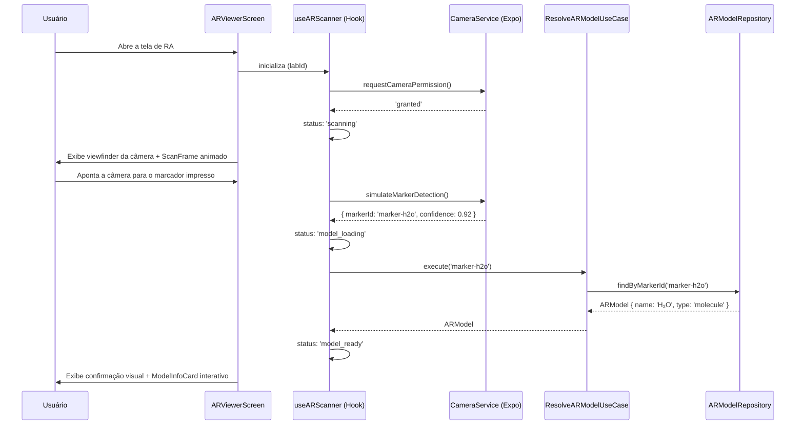

# AR-Lab Mobile (`ar-lab-react-native`)

<div align="center">

[](https://expo.dev)
[](https://reactnative.dev)
[](https://typescriptlang.org)
[](https://zustand-demo.pmnd.rs)
[]()
[](https://brasil.un.org/pt-br/sdgs/4)
[]()

<br/>

> **Aplicativo móvel em React Native com Realidade Aumentada** para apoio didático em laboratórios acadêmicos.
> Suporte a **Expo Go** para execução instantânea no dispositivo físico.
> Alinhado ao **ODS 4 da ONU — Educação de Qualidade**.

</div>

---

## 👥 Equipe e Funções

| # | Integrante | RA | Função |
|---|---|---|---|
| 1 | **Eduardo Augusto Prestes Júnior** | 252148 | *Tech Lead & Project Coordinator* — Arquitetura, Gestão e Dev Full-Stack |
| 2 | **Eduardo Cunha Soares** | 223988 | *Desenvolvedor Mobile & QA* — Testes e qualidade |
| 3 | **Leonardo de Arruda Macedo** | 223798 | *Desenvolvedor Mobile & Integração AR* |
| 4 | **Matheus de Souza** | 224282 | *UI/UX Designer & Frontend* |
| 5 | **Guilherme Augusto Ferreira** | 223291 | *Documentação & Pesquisa Científica* |

---

## 🎯 Visão Geral do Projeto

O **AR Lab Mobile** é um aplicativo educacional que transforma o smartphone do estudante em uma poderosa ferramenta de apoio dentro de laboratórios físicos. Ao apontar a câmera para **marcadores visuais** impressos nos roteiros de laboratório, o aluno visualiza **modelos 3D interativos** de moléculas, circuitos, estruturas biológicas e objetos geométricos diretamente sobrepostos ao ambiente real — sem necessidade de equipamentos especiais.

### 🌍 Alinhamento com ODS 4 — Educação de Qualidade
O projeto contribui diretamente para as metas da ONU ao:
- ✅ **Democratizar** o acesso a recursos visuais de alta qualidade em instituições com orçamento limitado
- ✅ **Ampliar** o entendimento de conceitos abstratos com visualização 3D imersiva
- ✅ **Incluir** estudantes com diferentes estilos de aprendizagem (visual, cinestésico)
- ✅ **Reduzir** a dependência de laboratórios físicos caros ou perigosos para etapas introdutórias

---

## 🛠️ Tecnologias Utilizadas — Justificativas Detalhadas

### 1. Expo SDK `57.x` — Plataforma de Desenvolvimento Mobile

**O que é:** Ecossistema e conjunto de ferramentas para criar, testar e publicar aplicações React Native universais (Android, iOS e Web).

**Por que foi escolhido:**
A adoção do Expo SDK 57 traz **agilidade máxima no desenvolvimento** e elimina a barreira de dependências nativas complexas (Android Studio / Xcode / Gradle). Através do aplicativo gratuito **Expo Go**, qualquer membro da equipe ou avaliador pode executar o projeto **diretamente em seu próprio celular físico** em segundos apenas escaneando um QR Code, sem necessidade de compilações nativas pesadas.

**Como funciona no projeto:**
- O servidor de desenvolvimento Metro é iniciado com `npx expo start`
- Gera um QR Code que conecta o app **Expo Go** (Android/iOS) diretamente à máquina de desenvolvimento
- Suporta modo `--tunnel` via ngrok para conectar o smartphone mesmo em redes Wi-Fi diferentes ou conexões de dados móveis
- Integra o `expo-camera` para captura de vídeo e permissões de hardware no Android e iOS

---

### 2. React Native `0.76.x` — Framework Mobile Principal

**O que é:** Framework de desenvolvimento mobile da Meta que permite escrever código JavaScript/TypeScript que compila para componentes nativos de iOS e Android.

**Por que foi escolhido:**
React Native foi escolhido pela sua capacidade de entregar **performance nativa** com uma única base de código. Diferente de soluções híbridas baseadas em WebView, o React Native renderiza componentes nativos reais — essencial para uma aplicação de câmera e RA onde a taxa de quadros (FPS) é crítica. A versão 0.76 utiliza a **Hermes Engine** por padrão, otimizando o consumo de memória e a velocidade de execução.

**Como funciona no projeto:** É o runtime que executa toda a lógica JavaScript, gerencia o ciclo de vida dos componentes e se comunica com os módulos nativos do Expo.

---

### 3. TypeScript `5.6.x` — Linguagem de Tipagem Estática

**O que é:** Superset do JavaScript que adiciona tipagem estática opcional, interfaces e enums.

**Por que foi escolhido:**
Em um projeto modular com Clean Architecture, o TypeScript captura erros de tipo em tempo de compilação, documenta automaticamente os contratos da camada de **Domain** e habilita autocompletar completo. Toda a regra de negócio é 100% tipada.

---

### 4. React Navigation `6.x` — Sistema de Roteamento Type-Safe

**O que é:** Biblioteca de navegação nativa para React Native.

**Por que foi escolhido:**
Oferece transições nativas fluidas (`slide_from_right`, `fade`), suporte completo a gestos e navegação estritamente tipada via `RootStackParamList`. O container de navegação se integra ao `ThemeContext` dinâmico do projeto.

---

### 5. Zustand `5.x` — Gerenciamento de Estado Global

**O que é:** Biblioteca de gerenciamento de estado previsível e minimalista baseada em hooks.

**Por que foi escolhido:**
Gerencia o estado da sessão de RA (`arScannerStore.ts`) sem o boilerplate verboso do Redux. Permite que os componentes assinem apenas as fatias de estado relevantes (`status`, `currentModel`, `scanTipVisible`), garantindo alta performance de renderização.

---

### 6. React Native Reanimated `3.x` — Animações em Thread Nativa

**O que é:** Biblioteca de animações que executa diretamente na UI thread do dispositivo.

**Por que foi escolhido:**
Garante animações a **60 FPS cravados** (linha de varredura do scanner, pulsação de confirmação visual, cards deslizantes) sem travar a thread de JavaScript.

---

### 7. Expo Camera (`expo-camera`) — Captura e Permissões de Câmera

**O que é:** Módulo nativo do Expo para acesso à câmera do dispositivo.

**Por que foi escolhido:**
Substituiu a API antiga `PermissionsAndroid` por um fluxo universal compatível com **Expo Go**, Android e iOS. O `CameraService.ts` encapsula a solicitação de permissões e a simulação de detecção de marcadores AR.

---

### 8. @react-native-async-storage/async-storage — Persistência Local de Tema

**O que é:** Banco de chave-valor assíncrono para armazenamento local.

**Por que foi escolhido:**
Persiste a escolha de tema do usuário (`dark` ou `light`) entre sessões no dispositivo, lendo a preferência no arranque do aplicativo.

---

### 9. Sistema de Tema Dual (Dark/Light Mode) — Design System Próprio

**O que é:** Tokens de cores, tipografia, elevação e gradientes com suporte a dois temas distintos.

- **Dark Mode (`#0A0E1A`):** Otimizado para ambiente de laboratório com baixa luminosidade e destaque neon `#22D3EE`.
- **Light Mode (`#F0F4FF`):** Tema claro e limpo para ambientes externos e leitura de roteiros acadêmicos.
- Alternância em runtime via componente `ThemeToggle` com transição suave interpolada por `Animated.Value`.

---

### 10. Sistema de Responsividade (`responsive.ts`)

**O que é:** Utilitários de escala baseados no iPhone 14 (375×812 dp) como resolução de referência.

- `rw(n)` — Escala horizontal
- `rh(n)` — Escala vertical
- `rs(n)` — Escala moderada (fontes e ícones)
- `rf(n)` — Fontes nítidas via PixelRatio
- Adaptável a smartphones pequenos, grandes e tablets.

---

## 📂 Estrutura do Projeto

```text
ar-lab-react-native/
│
├── App.tsx                                 # Raiz: ThemeProvider + NavigationContainer
├── index.js                                # Registro do componente raiz (registerRootComponent)
├── app.json                                # Configurações do Expo (permissões de câmera, ícones, plugins)
├── babel.config.js                         # Presets Expo + aliases de import + plugin Reanimated
│
└── src/
    ├── domain/                             # 🏛️ CAMADA DE DOMÍNIO (Pure TS, Zero dependências)
    │   ├── entities/                       # Laboratory, LaboratoryStep, ARModel, ARSession
    │   ├── repositories/                   # Interfaces (ILaboratoryRepository, IARModelRepository)
    │   └── usecases/                       # GetLaboratoriesUseCase, ResolveARModelUseCase
    │
    ├── data/                               # 💾 CAMADA DE DADOS (Implementação dos Repositórios)
    │   ├── datasources/                    # MockDataSource (Laboratórios e Modelos 3D)
    │   └── repositories/                   # LaboratoryRepositoryImpl, ARModelRepositoryImpl
    │
    ├── features/                           # 🧩 MÓDULOS (Feature-First Architecture)
    │   ├── ar-scanner/                     # Módulo de Realidade Aumentada
    │   │   ├── components/                 # ScanFrame, ModelInfoCard, ScanTipOverlay
    │   │   ├── hooks/                      # useARScanner (Hook Container de RA)
    │   │   ├── screens/                    # ARViewerScreen (Tela principal de RA)
    │   │   ├── services/                   # CameraService (expo-camera integration)
    │   │   └── store/                      # arScannerStore (Estado Zustand)
    │   │
    │   └── laboratory/                     # Módulo de Roteiros e Laboratórios
    │       ├── components/                 # LabCard
    │       └── screens/                    # HomeScreen, LabDetailScreen
    │
    ├── navigation/                         # 🗺️ NAVEGAÇÃO TYPE-SAFE
    │   ├── RootNavigator.tsx               # Stack Navigator (Home → Detail → ARViewer)
    │   └── types.ts                        # RootStackParamList (Tipagem estrita das rotas)
    │
    └── shared/                             # 🔧 COMPONENTES E UTILITÁRIOS REUTILIZÁVEIS
        ├── components/                     # Badge, ErrorState, LoadingOverlay, ThemeToggle
        ├── contexts/                       # ThemeContext (Gestão de tema + AsyncStorage)
        ├── theme/                          # tokens.ts (darkTheme/lightTheme), navigationTheme.ts
        └── utils/                          # responsive.ts (rw, rh, rs, rf, breakpoints)
```

---

## 🔮 Como Funciona o Fluxo de RA



---

## 🎨 Sistema de Design & Cores

### Paleta de Cores — Modo Escuro (Laboratório)

| Token | Hex | Aplicação |
|---|---|---|
| `bg.primary` | `#0A0E1A` | Fundo principal da aplicação |
| `bg.secondary` | `#111827` | Cartões, modais e containers |
| `brand.accent` | `#22D3EE` | Acento ciano neon (RA, scanner, destaques) |
| `brand.primary` | `#3B82F6` | Botões e ações primárias |
| `semantic.success` | `#10B981` | Confirmação de detecção de marcador |

### Paleta de Cores — Modo Claro (Acadêmico)

| Token | Hex | Aplicação |
|---|---|---|
| `bg.primary` | `#F0F4FF` | Fundo suave tom lavanda |
| `bg.secondary` | `#FFFFFF` | Cartões e superfícies elevadas |
| `brand.accent` | `#0891B2` | Acento azul petróleo para RA |
| `brand.primary` | `#2563EB` | Ações principais e botões |

---

## 📱 Como Executar o Projeto com o Expo Go

### 1. Pré-requisitos Básicos

| Requisito | Descrição | Link |
|---|---|---|
| **Node.js** | Versão 18 LTS ou superior | [nodejs.org](https://nodejs.org) |
| **Expo Go (App)** | Baixe no seu celular Android ou iOS | [Google Play](https://play.google.com/store/apps/details?id=host.exp.exponent) \| [App Store](https://apps.apple.com/app/expo-go/id982107779) |
| **Rede** | Celular e computador na mesma rede Wi-Fi (ou usar modo `--tunnel`) | — |

---

### 2. Passo a Passo de Execução

#### 📲 Opção A: Executar no Smartphone Físico via Expo Go (Recomendado)

```bash
# 1. Clone o repositório
git clone https://github.com/DJmesh/ar-lab-react-native.git
cd ar-lab-react-native

# 2. Instale as dependências
npm install

# 3. Inicie o servidor do Expo
npx expo start
```

Após executar o comando acima:
1. Um **QR Code** será exibido no terminal.
2. Abra o aplicativo **Expo Go** no seu celular:
   - **Android:** Toque em *"Scan QR Code"* dentro do app Expo Go e aponte para o terminal.
   - **iOS:** Abra o app de **Câmera nativo do iPhone**, aponte para o QR Code e toque na notificação para abrir no Expo Go.

---

#### 🌐 Opção B: Executar via Tunnel (Caso esteja em redes Wi-Fi diferentes ou 4G/5G)

Se o computador e o celular estiverem em redes Wi-Fi bloqueadas (redes universitárias) ou conexões diferentes, use o modo tunnel:

```bash
npx expo start --tunnel
```

---

#### 💻 Opção C: Executar em Emuladores Locais

```bash
# No Android Emulator (com Android Studio aberto)
npx expo start --android

# No iOS Simulator (macOS com Xcode)
npx expo start --ios
```

---

## 🧪 Verificação de Qualidade e Scripts

```bash
# Validação de Tipos TypeScript (sem emitir build)
npm run type-check

# Análise Estática de Código (ESLint)
npm run lint

# Formatação Automática de Código (Prettier)
npm run format

# Execução de Testes Unitários (Jest + Expo)
npm test
```

---

## 🏗️ Arquitetura Clean + Feature-First

```text
┌─────────────────────────────────────────────────────────────────┐
│  PRESENTATION LAYER (Features: ar-scanner, laboratory)          │
│  UI Components, Hooks Containers, Zustand Store, ThemeContext   │
├─────────────────────────────────────────────────────────────────┤
│  DATA LAYER (Repositories Implementation)                       │
│  LaboratoryRepositoryImpl, ARModelRepositoryImpl, MockData      │
├─────────────────────────────────────────────────────────────────┤
│  DOMAIN LAYER (Core Business Rules)                             │
│  Entities (Laboratory, ARSession), Use Cases, Repository Interfaces│
└─────────────────────────────────────────────────────────────────┘
```

---

## 📄 Licença

Distribuído sob a licença **MIT**. Veja [`LICENSE`](./LICENSE) para mais detalhes.

---

## 🙏 Agradecimentos

- **Prof. Dr. Ohata** — Orientação técnica e pedagógica
- **Expo & React Native Teams** — Ferramentas open-source excepcionais
- **ONU (Nações Unidas)** — Inspiração nos Objetivos de Desenvolvimento Sustentável (ODS 4)

---

<div align="center">

Desenvolvido com ❤️ para a disciplina de **Computação Móvel** — UNIP 2026

</div>